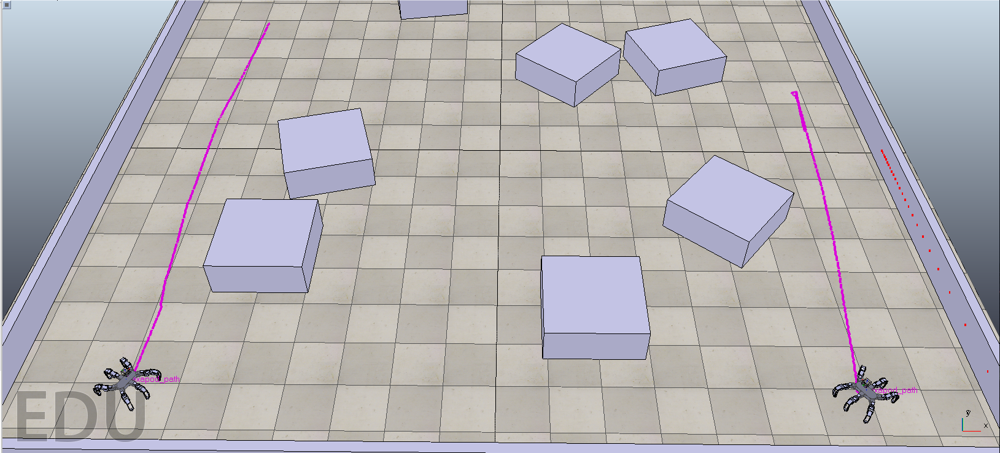
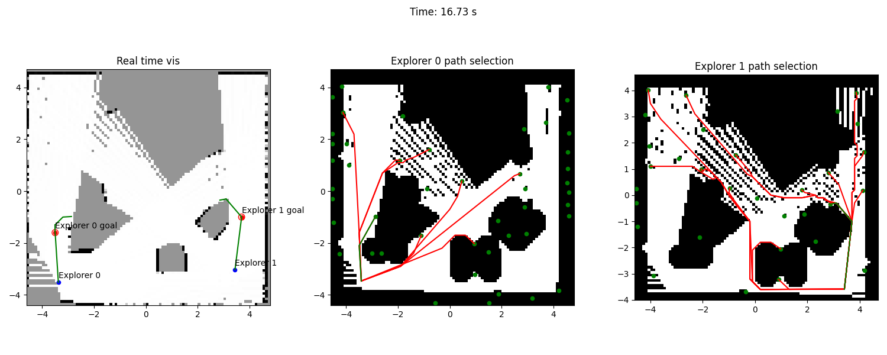

# RobExplore
It is capable of multi-robot exploration of unknown environments in CoppeliaSim simulation. The robots utilize LIDARs to scan the surrounding environment. Scans are used to create a map of the surrounding environment, which allows the robots to avoid obstacles and select the most promising frontiers for future exploration.

## Installation & Usage
Install the required packages using the following:
```bash
pip install -r requirements.txt
```
Download CoppeliaSim Edu from [web](https://www.coppeliarobotics.com/downloads) and extract the archive. The simulator can be started using the:
```bash
./coppeliaSim.sh
```
You can then load the scenes from the `vrep_scenes` directory. For the multi-robot exploration, use the `blocks_multirobot.ttt` scene, and the correctly loaded CoppeliaSim should look like this:



Run the multi-robot exploration using:
```bash
python Explorer.py
```
By default, the robots explore the closest frontier and don't use mutual information about the goal selection of the other robot. The option information can be accessed by `python Explorer.py --help`. The provided visualizations show the merged maps of the robots with the selected goals and the individual inflated maps of the robots with the accessible goals.



The `frontier_exploration_showcase.py` shows the frontier selection using different approaches. Finally, the script `single_explores.py` utilizes a single robot to explore the environment.

## Features
The created approach consists of several components described in the following sections. The components are designed to be modular so they can be easily replaced or extended. The components are:

### Mapping 
The robots collect the information from the lidar sensor and create a map of the environment. The created map is automatically enlarged when the laser measurements fall out of its boundaries.

### Frontier detection 
Free cells neighboring unobserved ones are grouped into free edge components, which are the most promising for exploration. The precise goals are then created using k-means clustering. Finally, the mutual information can be computed using the formulae presented by a region around the frontier to select the most interesting one. The area is a square with the frontier in the middle, as it is assumed that the robot observes all the cells in case of frontier exploration.

### Path planning 
The A* algorithm finds the shortest path to the selected frontier. First, the obstacles are inflated in the map to ensure that the robot does not collide with them. However, a small area around the robot is guaranteed free; otherwise, the planning could fail. Note that the unobserved cells are not inflated, as such action would prevent the robot from reaching the frontiers. Goals can be selected from the frontier based on the path length or the mutual information.

### Navigation
The robot follows the navigation goal using a simple control method. The robot is commanded to perform either forward or rotational movement. Such clear distinction allows the Navigation to closely follow the planned path using the A* algorithm, as the path consists of straight line segments. Additionally, the robot replans the path to account for unobserved cells transformed into obstacles. New obstacles result in more areas being covered by inflation; thus, the robot has to replan the path to avoid the newly inflated obstacles. The path is updated if the distance between the first point of the planned path and the robot is more significant than a certain threshold. Otherwise, the robot could start oscillating.

### Multirobot exploration 
The environment can be explored using multiple robots. The goals for robots are selected either greedily as the goal with the highest criterium value or using the MinPos strategy. The MinPos strategy ranks goals for each robot according to the number of robots closer to the goal than the robot itself. Then, the robot selects the goal with the lowest rank and minimal criteria among these ranks.

## Note
This project implements the semestral task for an Artificial Intelligence course at FEE CTU. 